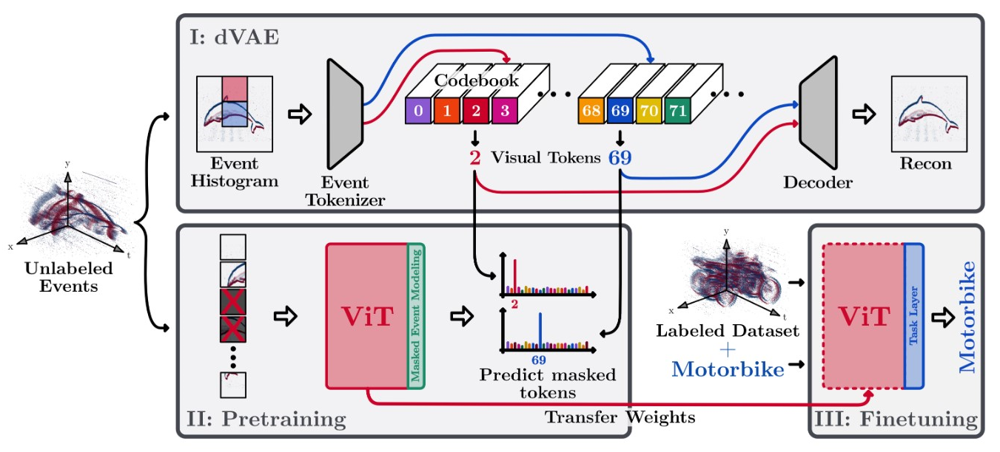

#### Klenk, S., Bonello, D., Koestler, L., & Cremers, D. (2022). Masked event modeling: Self-supervised pretraining for event cameras. *arXiv preprint arXiv:2212.10368*.

---

#### 1. Motivation

Transformer结构假设输入为Token seq，而不是frame-like，很适合处理Event数据。

但是ViT需要大规模训练数据，而Event缺乏有标记数据。因此，需要一个self-supervised的pre-train methods：

主要贡献：**以ECM输入的BEIT模型**

缺点：**但ECM损失了的temporal information**

---

#### 2. Methods

##### 2.1 dVAE

ECM由tokenizer转为feature，然后由Gumbel softmax替换为对应的vector（雷同word embedding），由Decoder重建输入的ECM

Codebook里面的每个Vector对应组成ECM的不同基本视觉特征，跟word embedding里面每个Vector对应不同word一样

##### 2.2 Masked Event modeling

50% masked ECM输入ViT，由Masked Event modeling（Classifier）预测masked patch在Codebook对应的index

---

#### 3. Experiments

在RGB ImageNet-21k上预训练的ViT，再在N-ImageNet 1K预训练，最后在下游数据集Fine-tune的效果很好

