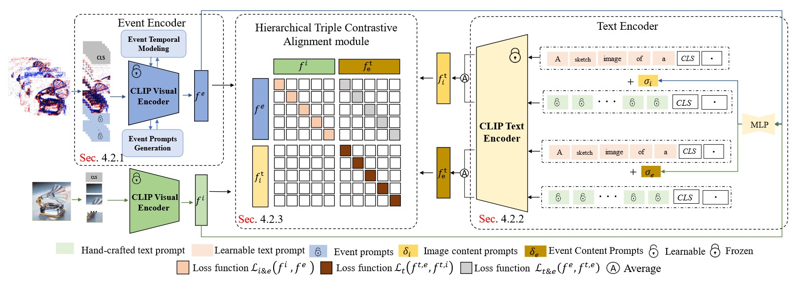
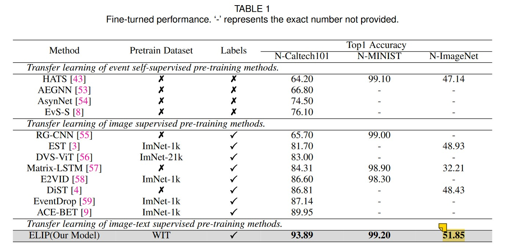
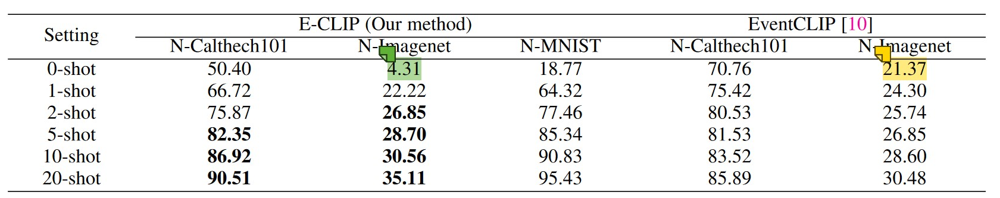
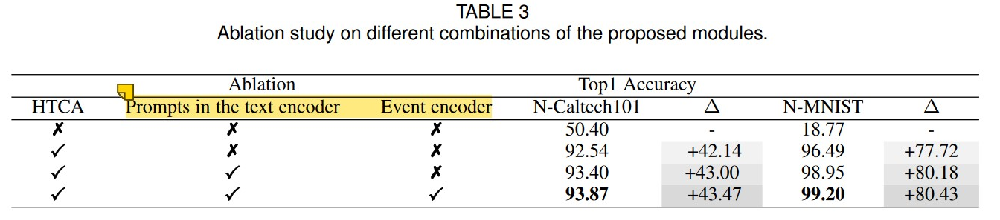
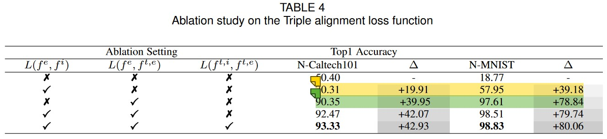

#### Zhou, J., Zheng, X., Lyu, Y., & Wang, L. (2023). E-CLIP: Towards Label-efficient Event-based Open-world Understanding by CLIP. *arXiv preprint arXiv:2308.03135*.

---

#### 1. Motivation

我们的目标是释放 CLIP 在基于事件的识别任务中的潜力，以弥补大规模基于事件的数据集的稀缺性

---

#### 2. Methods

##### 2.1 Event Encoder

##### 2.1.1 Event Input

1）对于N-ImageNet，将Event stream按每40000个event为一窗口划分，每个窗口分极性得到ECM，一张Image可以对应5个Event frames

2）Colorization：

	- RGB mode：positive和negative ECM分别乘以255, 255]和[255, 255, 0]，再相加
	- Gray mode：positive和negative ECM都乘以[127, 127, 0]，再相加

3）最终，$\mathbb{R}^{T\times H \times W \times 3}$

Event encoder以CLIP Image encoder参数初始化

##### 2.1.2 Event Temporal Modeling

1）仿VIT，每个Event frame分patch，进行Patch embedding

2）加上可学习的positional encoding（分别对spatial和temporal都有positional encoding）

3）为每个event frame分别加上[CLS] token

1）在每个transformer层前，对所有[CLS]构成seq进行norm+SA，得到cross frame prompts seq

2）将cross frame prompts加入**原来对应**的event frame seq，进行SA

##### 2.1.3 Event Prompts Generatio

仿造Visual Prompt Tuning，在每个transformer层前，为每个event frame seq加入learnable prompt token

最终，每个event frame的[CLS]取平均，再linear projection，得到Event embedding

##### 

##### 2.2 MLP

一个MLP，以Image embedding和Event embedding为输入，输出event content prompts 和 the image content prompts

目的是为了与word embedding后的Text prompts保持同一维度

##### 2.3 Hybrid Text Prompts

仿造KgCoOp：

1）handcraft prompt和learnable prompt相加，缓解模型的Fine-tune和zero-shot的矛盾

2）加入Event / Image content prompts，可以增强text prompt

##### 2.4 Hierarchical Triple Contrastive Alignment (HTCA)

实验表明，任何进行Image-text的fine-tune都会导致性能下降

左上角：Event-Image pair计算对比学习loss

右下角：lable(Event) - label(Image) pair计算对比学习loss

右上角：Event-label pair计算对比学习loss

3个loss权重相同，以确保3者大小分布处在同一数量范围内

---

#### 3. Experiments

##### 3.1 Fine-tune结果

##### 3.2 Zero-shot、few-shot结果

Event encoder和Hybrid Text Prompts引入了learnable prompt，因此zero-shot不行。但也因此few-shot更好

##### 3.3 Ablation study

核心是HTCA，Hybrid Text Prompts和Event encoder作用不大

****

**”Event-label pair计算对比学习loss“ 比 “Event-Image pair计算对比学习loss” 更有用**