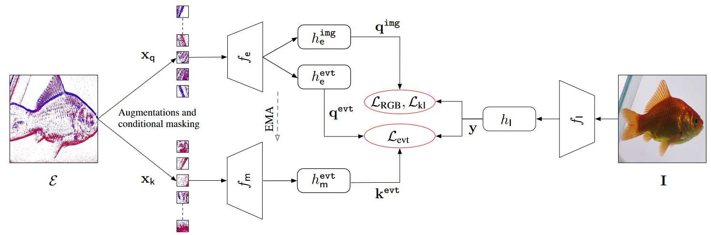
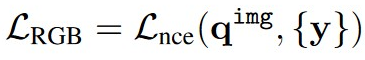
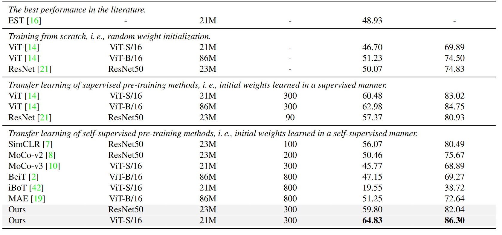
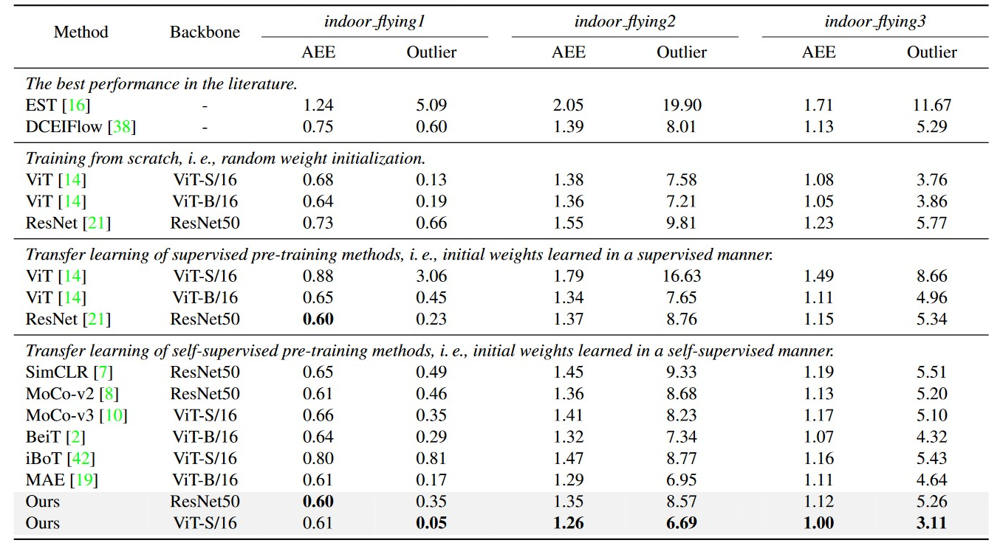

#### Yang, Y., Pan, L., & Liu, L. (2023). Event Camera Data Pre-training. *arXiv preprint arXiv:2301.01928*.

---

#### 1. Motivation

打算仿造MoCo架构，提出一系列Event data augmentations。

但是，发现CMC式的对比学习，由于Event的稀疏特点，很容易导致模型崩溃，产生过度相似的Embedding。因此，引入paired RGB images实现正则化

**主要贡献：迁移MoCo框架，但是因为Event稀疏性受阻，而将Event feature投影到RGB imager feature。同时采用跨模态对比学习**

---

#### 2. Methods

##### 2.1 Event Contrastive learning

1）Event首先进行data augmentations。

2）ECM分patch，以每个patch中Event数量计算information quantity，以此作为采样概率：

- **信息量越大的Patch，被采样的概率越大**。避免因为Event稀疏性导致均匀随机采样出很多无意义patches

3）按概率分布随机采样固定数量的Patches，分别采样出$x_{q}$，$x_{k}$

4）按MoCo-v3架构进行对比学习

​                                                                          

5）因为Event稀疏性，正样本、负样本过于相似，难以区分，导致模型训练奔溃。作者发现paired RGB Image embedding是非常好的bias。将正样本、负样本投影到RGB Image embedding后更容易区分，实现一种正则化：

##### 2.2 Event and RGB Contrastive learning

1）因为Event稀疏性，自监督很难训练。可以通过align Event和RGB来利用pre-train RGB network：

##### 2.3 Event and RGB KL divergence

为了帮助Event and RGB Contrastive learning更好地align Event和RGB，用KL散度来最小化**分布不匹配**：

Event、RGB样本通过 计算Sim、softmax 近似概率分布，再计算KL divergence

---

#### 3. Experiment

##### 3.1 Implementation

	- Event backbone $f_{e}$和$f_{m}$选择ViT-S/16、ResNet50（是否在RGB pre-train）
	- Image backbone $f_{I}$ 选择pre-trained ViT-B/32
	- projection head $h_{e}^{evt}$、$h_{m}^{evt}$、$h_{e}^{img}$与MoCo-v3一致

3个downstream tasks：object recognition，optical flow estimation，semantic segmentation

##### 3.2 Object recognition

1）Training from scratch：随机初始化权重，再在N-ImageNet上fine-tune

2）Transfer learning of supervised pre-training methods：在ImageNet-1k上有监督预训练，再在N-ImageNet上fine-tune

3）Transfer learning of self-supervised pre-training methods：在ImageNet-1k上无监督预训练，再在N-ImageNet上fine-tune

同样也在N-Cars，N-Caltech101，CIFAR-10-DVS上fine-tune后评估

##### 3.3 Optical flow estimation

在ImageNet-1k上预训练，在MVSEC上fine-tune评估

##### 3.4 Semantic segmentation

在ImageNet-1k上预训练，在DDD17、DSEC上fine-tune评估
