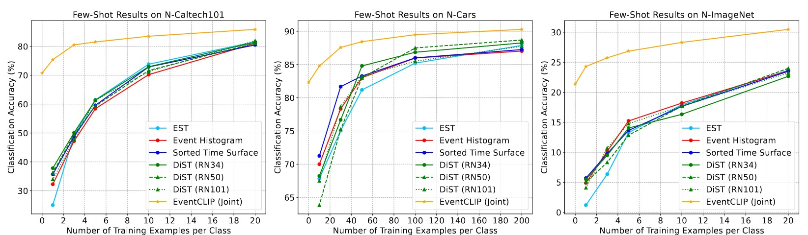

#### Wu, Z., Liu, X., & Gilitschenski, I. (2023). EventCLIP: Adapting CLIP for Event-based Object Recognition. *arXiv preprint arXiv:2306.06354*.

---

#### 1. Motivation

预训练VLMs（e.g. CLIP）迁移到Event domain，实现zero-shot或few-shot的classification。

**主要贡献：仿PointCLIP，实现Event-based Object Recognition的zero-shot、few-shot**

---

#### 2. Methods

##### 2.1 Event representation

1）Events stream分成M个time windows，每个time windows得到一个2 channel ECM（Event Histograms）

2）通过pre-defined RGB color map，得到3 channel Event frames

(为了降低计算量没有选择Reconstruction，而是直接转换：比如empty pixel对应白色)

#####2.2 Zero-Shot Classification

冻结CLIP Image encoder和text encoder的参数。

1）Point-CLIP：

将point cloud投影成mult-view Image（front, right, back, left, top, bottom），提取Image feature 与 Text Prompt feature 计算Sim。

不同数据的projected views order相同，可以将各view预测结果权重作为超参，综合进行预测

2）Event-CLIP：

不同Event stream运动轨迹不同，无法给不同time wimdows分配固定权重。因此，做order-invariant的假设，各time wimdows ECM预测结果平均来得到最终预测

##### 2.3 Few-Shot Feature Adapter

对于few-shot任务，为了避免过拟合，冻结CLIP Image encoder和text encoder的参数。训练一个Adapter来细化Image representation成Event representation。

同时，避免Adapter（lightweight 2-layer Transformer）过拟合，采用residual connections：

- $f_{i}$是Image feature
- $\tilde{f}_{i}$是adapter输出feature
- $f_{i}^{*}$是residual connections后feature

---

#### 3. Experiments

##### 3.1 zero-shot结果

##### 3.2 few-shot结果

