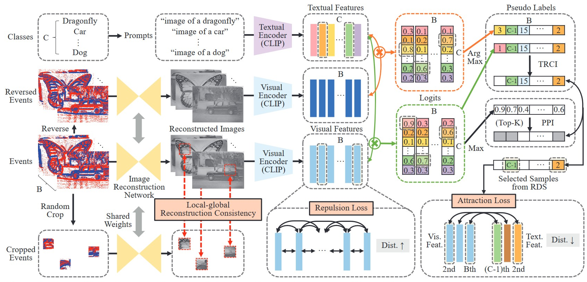

#### Cho, H., Kim, H., Chae, Y., & Yoon, K. J. (2023). Label-Free Event-based Object Recognition via Joint Learning with Image Reconstruction from Events. *arXiv preprint arXiv:2308.09383*.

---

#### 1. Motivation

label可以提高Reconstruction质量，reconstructed images的识别更准。因此，joint learning：object recognition和E2I reconstruction

---

#### 2. Methods

##### 2.1 CLIP-driven Object Recognition

由Event重建出Image，对Reconstructed image进行zero-shot Object Recognition，得到pseudo label

##### 2.2 Category-guided Attraction Loss

根据pseudo label，用CLIP对比学习loss，训练Image Reconstruction Network

Image feature和pseudo label所得text feature构成正对，相似度越大越好。Image feature和其它text feature构成负对，相似度越小越好

##### 2.3 Category-agnostic Repulsion Loss

自己输出pseudo label监督自己训练，缺乏正确监督信号，模型奔溃。表现为：最终所有Image都被预测成同一类别

通过增加各Image feature距离来防止奔溃：

（各Image feature两两相似度越小越好）

##### 2.4 Posterior Probability Indicator

pseudo label预测可靠性影响极大，通过后验概率采样更可靠的样本进行Category-guided Attraction Loss训练重建网络：

	- 每个Reconstructed Image预测出最可能的pseudo label，并给出该pseudo label的后验概率
	- 采样该Batch中前K个后验概率的样本（因为预测的把握更大，pseudo label更可靠）

##### 2.5 Temporally Reversed Consistency Indicator

对Event进行增强（比如：Temporally Reversed），采样原样本和增强样本预测类别一致的样本，认为更可靠

最终，只有Posterior Probability Indicator和Temporally Reversed Consistency Indicator采样的样本交集会被用于计算Category-guided Attraction Loss训练重建网络

##### 2.6 Local-global Reconstruction Consistency

- 作为一个spatial regularization
- 捕捉局部细节，提高重建质量

##### 2.7 Employing Unpaired Images

利用网络爬取的unpaired images提高重建质量和预测准度

