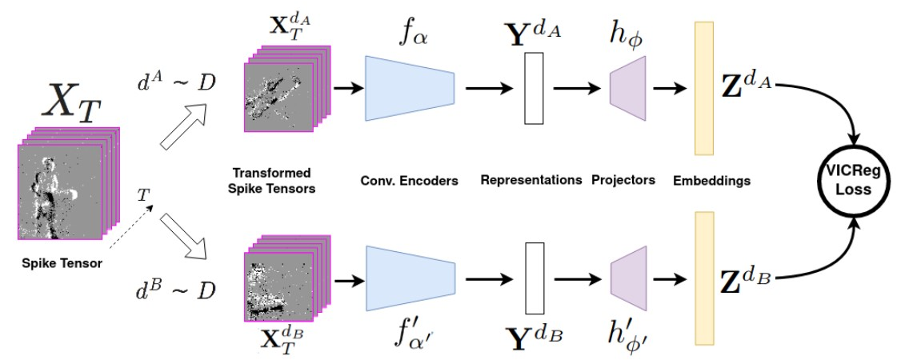

#### Barchid, S., Mennesson, J., & Djéraba, C. (2023). Exploring Joint Embedding Architectures and Data Augmentations for Self-Supervised Representation Learning in Event-Based Vision. In *Proceedings of the IEEE/CVF Conference on Computer Vision and Pattern Recognition* (pp. 3902-3911).

---

#### 1. Motivation

过去SSRL方法只是在short event sequences上取得成功，像human activity recogntion等long event sequences还没有被探索。

他们提出一个由（2D, 3D, and Spiking）组成的轻量化CNN encoder在short，long event sequences表现都很好。

**主要贡献：迁移SimCLR框架(VICReg)，整合出系统的Event augmentations方法。同时，实验2DCNN、3DCNN、SCNN架构encoder组合**

---

#### 2. Methods

##### 2.1 VICReg的框架

Encoders可以选择：2D CNN（ResNet-18），3D CNN（MC3-ResNet-18），CSNN（SEW-ResNet18）

- Twins变体：encoder共享参数
- Student-Teacher变体：CSNN表达能力弱于CNN。因此，一个encoder选择CSNN（student network），一个encoder选择CNN（teacher network）

##### 2.2 Event Data Augmentation

整合了一系列EDA方法：

---

#### 3. Experiments

##### 3.1 Datasets

上面是human action recognition，long event sequences

下面是object recognition，short event sequences

##### 3.2 Results

- Linear：Linear probing
- SemiSup-x%：x%的数据用于fine-tune整个模型，其余用于Linear probing
- $CSNN_{2D}$：Student-Teacher变体

1）表明CSNN encoder 没有 CNN encoder好。

2）因为是Linear probing实验，没有comparied methods
