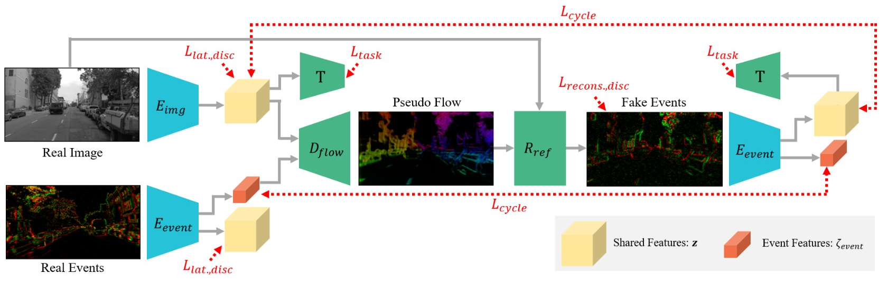

#### Messikommer, N., Gehrig, D., Gehrig, M., & Scaramuzza, D. (2022). Bridging the gap between events and frames through unsupervised domain adaptation. *IEEE Robotics and Automation Letters*, *7*(2), 3515-3522.

---

#### 1. Motivation

由于现有Event方法由于标记数据集短缺而受阻。因此，作者采用UDA方法，即在有标签image domain训练task network，再迁移到unpaired unlabled event domain

---

#### 2. Methods

a）因为Event、Image信息本身不对齐，在embedding space完全对齐是不可能的。因此，从event中分离出event features和shared features：

- $L_{lat,disc}$：通过PatchGAN discriminator和对抗性损失，来约束event features和shared features的分离

b）由于Image缺少motion information，直接生成Event是ill-posed的。因此，由image feature结合event feautres来生成Event

 - $L_{recons,disc}$：通过event discriminator和对抗性损失，来约束生成Event属于Event domain，且保留了Image内容信息

   

c）生成Event经过Event encoder，再次分离特征

- $L_{cycle}$：用Consistency loss约束分离出的Event features和融入时的Event features一致
- $L_{cycle}$：用另一个Consistency loss约束分离出的Image features和融入时的Image features一致

d）分离出的Image features和融入时的Image features分别通过Task network，生成semantic map

- 由Task loss约束

通过adversarial loss 和 Consistency loss，训练Image生成Event的辅助Task。在此过程中在embedding space对齐Image和Event。

实现trained Image domain task network迁移至Event domain。

但是，Image to Event 这个生成任务不好，需要从still image中产生hallucination of motion，这是一个ill-posd问题。