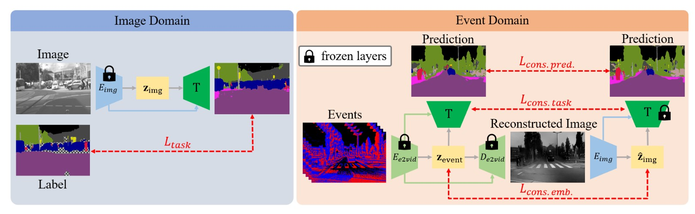
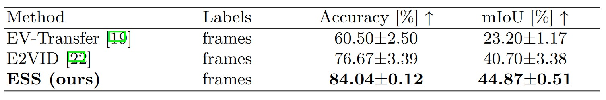
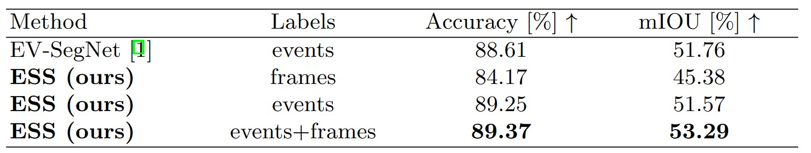

#### Sun, Z., Messikommer, N., Gehrig, D., & Scaramuzza, D. (2022, October). Ess: Learning event-based semantic segmentation from still images. In *European Conference on Computer Vision* (pp. 341-357). Cham: Springer Nature Switzerland.

---

#### 1. Motivation

a）对于汽车安全系统，提取出detailed且dense的语义信息是必要的 ---> Semantic segmentation task

b）引入Event data可以standard camera改善在edge-case scenarios（HDR、high speed）motion blur，over-exposure，under-exposure问题，并提供低延迟优势

c）缺少高质量event-based semantic segmentation datasets：

- 提供一个新的event-based semantic segmentation dataset：DSEC Semantic
- 提出一个新的unsupervised domain adaptation (UDA)（将任务从标记的图像数据集转移到未标记的事件域）

##### 1.1 Background

a）2019 Ev-segNet：采用pseudo-labels，质量低下

b）2019 E2VID：event重建video，再end task。two-stages会累计error

c）2020 VID2E：still image需要利用虚拟相加移动，video需要插帧，效果不好

d）2021 EvDistill：实现了迁移Cityscapes labels到unpaired DDD17 event，但是实验结果仅报告了paired images and events

因此，作者选择采用unsupervised domain adaptation，通过约束image和event embedding到同一空间，则**隐式**利用image-lables为unpaired event提供pseudo-labels。

---

#### 2. Methods

First stages（仅在Image Domain）：

a）训练Task network，根据image embedding得到prediction map

Second stages（Image Domain、Event Domain）:

a）Events由E2VID生成Image，Events和生成Image同样由Task network得到prediction map

通过各种consistency losses，约束 events 和 images embedding 到同一空间：

 - events 和 images embedding直接计算L1 loss：

 - events 和 images 经过task network每一层输出，计算L1 loss：

 - events 和 images 得到的prediction map，计算JS散度：

---

#### 3. Experiments

##### 3.1 DDD17

​	UDA setting：训练时，Cityscapes提供image和labels，DDD17提供unpaired的event；pseudo-lables作评估（"frame labels"）

​	supervisied setting：训练时，DDD17提供event和pseudo-lables；pseudo-lables作评（“event labels”）

##### 3.2 DSEC-Semantic

​	UDA setting：训练时，Cityscapes提供image和labels，DSEC-Semantic提供unpaired的event；pseudo-labels作评估

