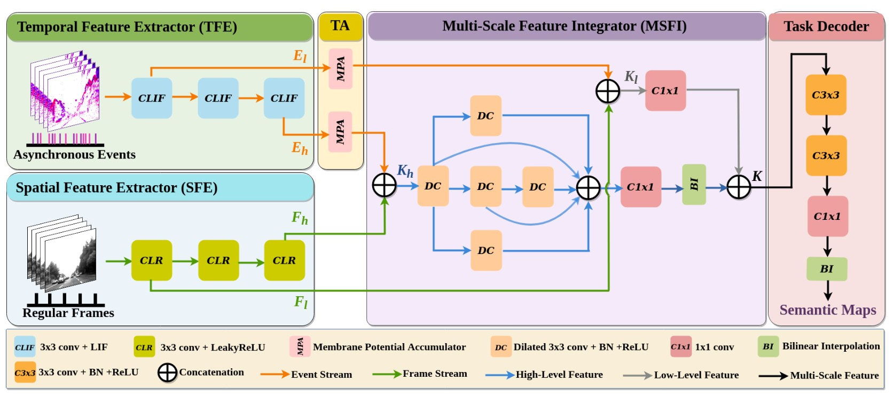

#### Biswas, S. D., Kosta, A., Liyanagedera, C., Apolinario, M., & Roy, K. (2022). HALSIE--Hybrid Approach to Learning Segmentation by Simultaneously Exploiting Image and Event Modalities. *arXiv preprint arXiv:2211.10754*.

---

#### 1. Motivation

##### 1.1 Event assist

Event data 稀疏，场景contextual information不完整，不利于dense preditction。

frames data不适合low light、high speed环境

因此，应该结合两个传感器优点，融合特征互补时空信息。

##### 1.2 hybrid architecture

event输入SNN，frames输入ANN，可以降低Inference Energy和model size

---

#### 2. Methods

Event以voxel形式，通过Leaky-Integrate-and-Fire (LIF)，提取特征

Frames由3*3conv提取特征

两模态特征Concat Fusion后，经过Dliated Conv空洞卷积，解码出Semantic maps