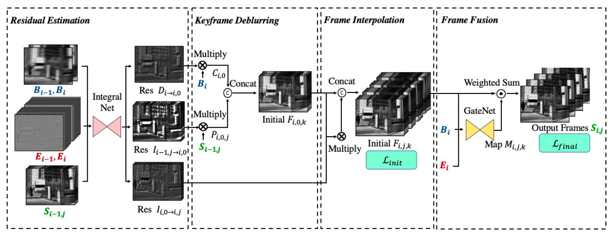
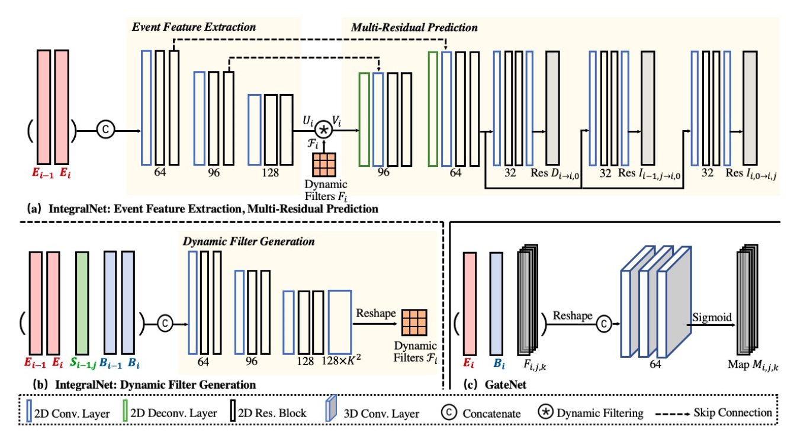

#### Lin, S., Zhang, J., Pan, J., Jiang, Z., Zou, D., Wang, Y., ... & Ren, J. (2020). Learning event-driven video deblurring and interpolation. In *Computer Vision–ECCV 2020: 16th European Conference, Glasgow, UK, August 23–28, 2020, Proceedings, Part VIII 16* (pp. 695-710). Springer International Publishing.

---

#### 1. Motivation

##### 1.1 Idea

针对EDI，在event-based BFI task上的改进：

a）降噪：

- 采用DNN进行预测，而直接使用积分公式
- 预测<u>sharp latent image之间</u>、<u>Blurry和sharp image之间</u>的**残差**

b）建模threshold：

- Standard Conv共享Conv filter，空间不变。但是threshold随时空变化，因此选择用Dynamic Conv建模threshold分布

---

##### 1.2 离散的EDI

a）假设$N=2$，即每个exposure time内的Blurry image$B_{i}$ deblurry并interpolate出sharp latent image$[S_{i,-2},S_{i,-1},S_{i,0},S_{i,1},S_{i,2}]$

b）exposure time为$T$，给一个间隔$\Omega _{i,j\to i',j'}=[iT,\frac{j}{2N}T,i'T,\frac{j'}{2N}T ] $的Event $e_{m}$，可以由$S_{i,j}(x,y) $重建出$S_{i',j'}(x,y) $：

**其中，$I_{i,j\to i',j'}(x,y) $是二者的插值。**

c）同样，可以由第$i$曝光区间内，第$0$张sharp latent image $ S_{i,j_{0}}(x,y)$重建出Blurry image $B_{i}(x,y)$：

**其中，$D_{i\to i,j_{0}}(x,y)$是二者的插值。**

---

#### 2. Methods

##### 2.1 Overall

---

##### 2.2 Residual Estimation

##### 利用<u>先前和当前的Blurry image</u>，<u>先前和当前的Event data</u>，<u>先前重建的所有sharp latent image</u>估计出，用于重建当前所有sharp latent image所需的残差

a）Event Feature Extraction

因为所需残差D，I按EDI公式，应该完全来自Event的积分。因此，只以Event作为Event Feature Extraction的输入。

Event Representation：假设$N=2$，先按latent image对应的2N+1等时间区间分配Event，每个区间再按bin=2的voxel分配

b）Dynamic Filter Generation

将<u>先前和当前的Blurry image</u>，<u>先前和当前的Event data</u>，<u>先前重建的所有sharp latent image</u> Concat到一起，生成Dynamic Filter。

类似以Event为Key、Value；	Event + Blurry image + sharp latent image作为Query。

c）Multi-Residual Prediction

上采样后，分别从三个predictor得到想要的残差：

---

##### 2.3 Keyframe Deblurring

##### 根据残差和EDI公式重建当前时刻第0个（中心）sharp latent image

a）根据残差$D_{i\to i,j_{0}}(x,y)$，由当前的Blurry image $B_{i}$重建出sharp image $C_{i,0}$（当前时刻，第0个（中心）sharp latent image）

b）根据残差$I_{{\color{Red} i-1,j} \to {\color{Red} i,0} }(x,y)$，由先前的每一个sharp latent image $S_{i-1,j},j\in {\color{Red}(} -N,N]$ （一共2N个）重建出sharp image $P_{i,0,j}$**（还是当前时刻，第0个（中心）sharp latent image）**：

c）上述两个结果，Concat起来得到$F_{i,0,k},k\in [0,2N]$（一共2N+1个）

---

##### 2.4 Frame Interpolation

##### 根据残差和EDI公式重建当前时刻其它sharp latent image

根据残差$I_{{\color{Red} i,0} \to {\color{Red} i,j} }(x,y)$，由$F_{i,0,k}$重建出当前时刻其它sharp latent image：

注意，$F_{i,0,k}$中的每一张sharp latent image都被插值到其它时刻，因此最后是（2N+1）*（2N）

---

##### 2.5 Frame Fusion

##### 由Frame Interpolation结果，当前Blurry image，当前Event通过GateNet得到一个attention map，用来Fusion上述Frame Interpolation结果的2N（k索引维度）

---

##### 2.6 Loss Function

a）Frame Interpolation和Groundtruth计算MSE，约束IntergralNet：

b）最终sharp latent image和Groundtruth计算MSE，同时约束IntergralNet和GateNet

