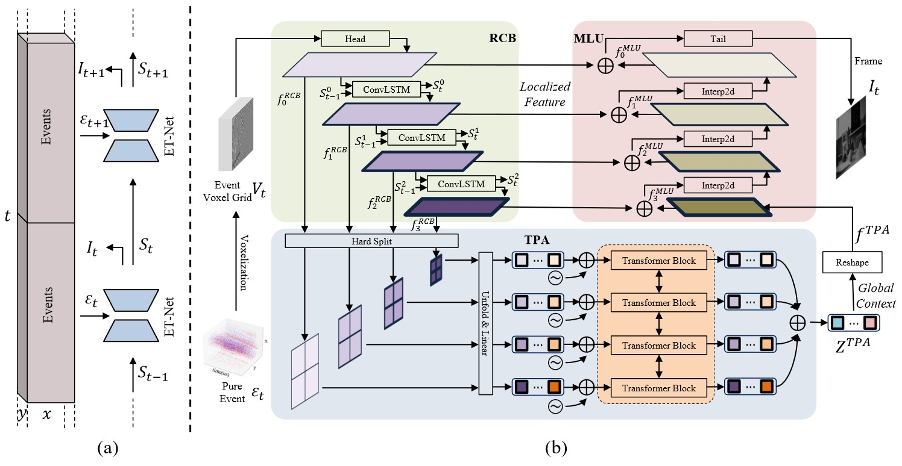
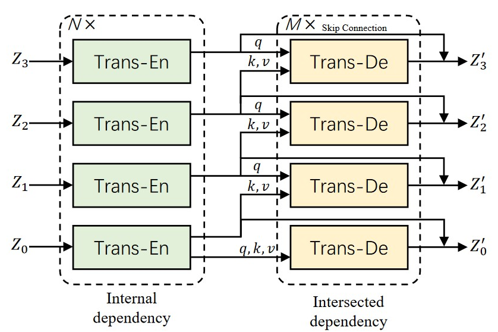

#### Weng, W., Zhang, Y., & Xiong, Z. (2021). Event-based video reconstruction using transformer. In *Proceedings of the IEEE/CVF International Conference on Computer Vision* (pp. 2563-2572).

------

#### 1. Motivation

hybrid CNN-Transformer architecture：兼具二者优点，CNN的*detailed multi-resolution spatial information*（不用16x下采样，具有不同尺度特征），transformer的modeling global context information

------

#### 2. Methods

##### 2.1 Overview of framework

---

##### 2.2 Recurrent Convolution Backbone（RCB）：

##### 从event voxel grid中提取feature pyramid

ConvLSTM：RNN结构利用先前的状态来增强重建的时间稳定性，Conv2D stride=2来获得multi-scale feature pyramid

---

##### 2.3 Token Pyramid Aggregation（TPA）：

##### 从feature pyramid建模*internal*（每个scale序列内部）和*intersected*（相邻scale序列交互）的长期依赖，输出global context

a）Image sequentialization：multi-scale feature $\mathbf{f}_{l}^{RCB}  \in \mathbb{R} ^{C_{l}\times \frac{H}{2^{l} } \times  \frac{W}{2^{l} }} ,l\in {0,1,2,3}$ 被分为**相同数量**的patches $ \in \mathbb{R} ^{C_{l}\times \frac{8}{2^{l} } \times  \frac{8}{2^{l} }}$ 

b）与VIT相同，应用linear projection和sinusoidal positional encoding

c）每个scale都经过一个Transformer encoder实现每个scale序列内部交互

d）以低scale作为K, V，高scale作为Q，经过一个Transformer decoder实现相邻scale序列交互

e）将经过Transformer encoder特征，通过skip connection加回来，以maintain the internal dependency

f）最后，将各scale输出特征**相加**

---

##### 2.4 Multi-Level Upsampler（MLU）：

##### 聚合localized feature（feature pyramid）和global context，上采用重建intensity image

Interp2D是一个factor为2的bi-linear interpolation，随后跟一个channel翻倍的a convolutional layer

---

##### 2.5 Loss function

与E2VID 2、FireNet一样：

​	a）LPIPS loss

​	b）temporal consistency loss

