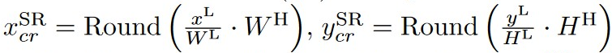
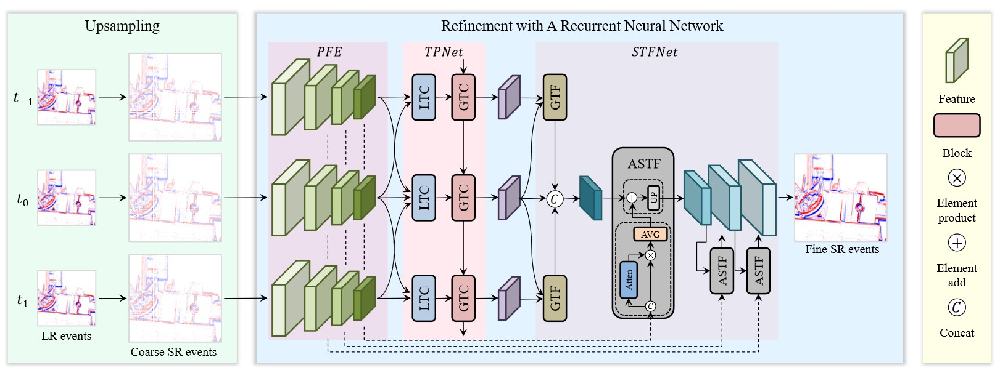
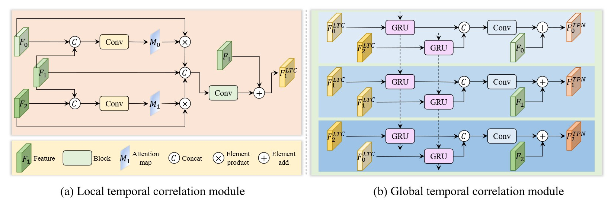
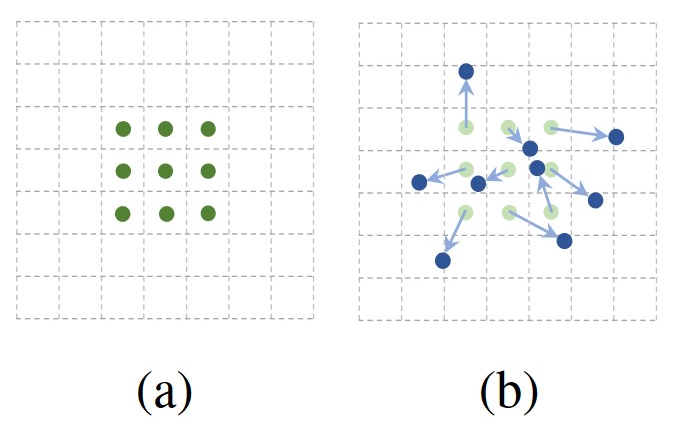
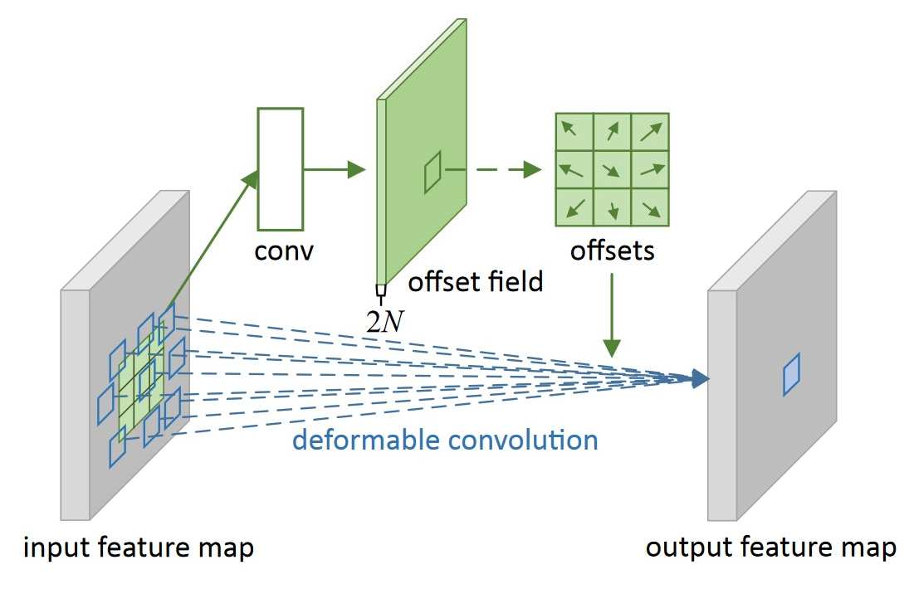
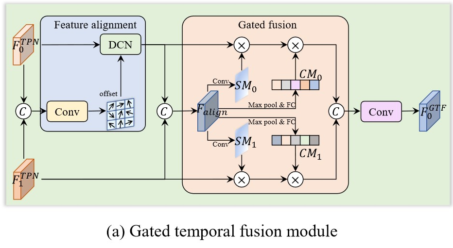
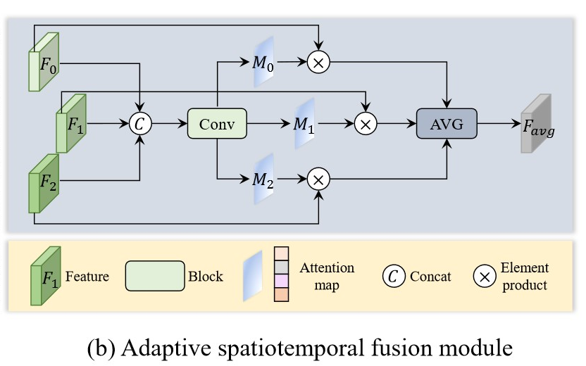
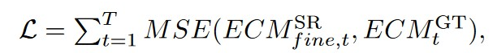

#### Weng, W., Zhang, Y., & Xiong, Z. (2022, October). Boosting event stream super-resolution with a recurrent neural network. In *European Conference on Computer Vision* (pp. 470-488). Cham: Springer Nature Switzerland.

------

#### 1. Motivation

##### 1.1 过去方法的缺陷 & paper目标

 - Event SR需要高质量的HR frames辅助。但在高速/HDR环境，难以获取高质量的frames

 - large factor（8×，16×）还无人探索。因为previous methods用的Unet和SNN结构在large factor下训练所需内存太大，无法支撑。

   如果通过多次small factor来得到large factor，这会导致不可避免的性能下降，同时牺牲运行时间。

因此，作者提出一个**无需高质量HR frames**的**适用large factor**的 SR模型。

------

##### 1.2 概述

- 通过attention机制和RNN建模local和global temporal correlation

- 通过DCN fusion不同timestamp特征
- 通过多次skip connection，逐步融合 <u>不同scale的spatial feature</u> 和 <u>已经fusion的 temporal feature</u>

------

#### 2. Methods

##### 2.1 Input

2D LR Event Count ( ECM )：计数Event的数量，以消除时间维度的同时，描述Event空间维度

为了平衡ECM的temporal correlation损失 和 Event by Event的高额计算开销，选择使用**ECM序列**作为模型输入

------

##### 2.2 Upsampling

通常，应该使用Bicubic将LR ECM变为SR ECM，但实验证明这样会不可避免地引入*插值噪声*。

因此，作者设计了coordinate relocation插值方法：

​		保持同样的Event数量（**不插值**），直接对每个Event坐标进行等比例映射

------

##### 2.3 Pyramidal Feature Extractor (PFE)

a）head：convolution（stride=1, 增加维度）

b）3个stacked convolutional blocks：convolution（stride=2，维度翻倍）

------

##### 2.4 local temporal correlation module：

##### 以自己为Query，通过spatial attention建模neighboring event-aware contexts

a）例如计算$F_{1}^{LTC}$时：

 - 以PFE **scale最小**的特征$F_{0}, F_{1}, F_{2}$作为输入

 - $F_{1}$作为Q，以$F_{0}$ ($F_{2}$) 作为K, V，**同时计算两个soft attention**

 - **skip connection**加上$F_{1}$

   

b）例如计算$F_{0}^{LTC}$时：

- $F_{0}$作为Q，以$F_{1}$作为K, V，**只计算一个soft attention**（neighboring！）

  

c）最终得到$F_{0}^{LTC}$，$F_{1}^{LTC}$，$F_{2}^{LTC}$

------

##### 2.5 global temporal correlation module：

##### 通过hidden state建模long-range event-aware contexts

- 以$F_{0}^{LTC}, F_{1}^{LTC}, F_{2}^{LTC}$ 作为输入
- 经过Bi-GRU
- **skip connection**加上$F_{0}, F_{1}, F_{2}$
- 最终得到$F_{0}^{TPN}$，$F_{1}^{TPN}$，$F_{2}^{TPN}$

------

##### 2.6 Gated temporal fusion module：

##### 通过可变形卷积将$F_{1}^{TPN}$和$F_{2}^{TPN}$对齐到center timestamp，在通过attention进行fusion

a）Deformable Conv：

用于建模standard Conv忽略的**几何变换**

- 根据输入feature，预测offset
- 根据offset，偏移Conv的采样点
- 通过双线性插值得到采样点值

b）例如计算$F_{0}^{GTF}$时：

- 利用offset，**可变形卷积**align$F_{0}^{TPN}$到$F_{1}^{TPN}$的timestamp

 - *$F_{1}^{TPN}$* 和 *aligned后的$F_{0}^{TPN}$* 分别交换Q, (K, V)来计算**spatial attention**

 - 类似SENet，计算**channel attention**：i) GMP作squeeze    ii) 两个FC先降后升   iii）pixel-wise product

b）类似的，通过align到center timestamp，最终得到$F_{0}^{GTF}$和$F_{2}^{GTF}$

------

##### 2.7 Adaptive spatiotemporal fusion module：

##### 通过skip connecntion来fusion <u>已经temporal fusion过的$F^{GTF}$</u> 和 <u>不同scale的spatial pyramidal feature</u>

a）聚合并行的三个spatial attention结果，得到该scale下的$F_{avg}$

b）通过skip connection，融合该scale下的$F_{avg}$和$F^{GTF}$

------

##### 2.8 Loss funciton

​	超分后的ECM和GT ECM计算**L2 loss**

------

##### 2.9 HR event stream

​	根据HR ECM，随机/均匀分配timestamp，生成最终HR event stream

------

#### 3. Experiment

##### 3.1 Metric

RMSE：MSE开平方
$$
RMSE=\sqrt{\frac{1}{N} \sum_{i=1}^{n} (y_{i}-f(x_{i} ) )^{2} } 
$$

##### 3.2 Ablation study

|                    | w/o LTC | w/o GTC | w/o GTF | w/o ASTF |
| ------------------ | ------- | ------- | ------- | -------- |
| RMSE会**变差**多少 | 0.009   | 0.002   | 0.006   | 0.003    |

