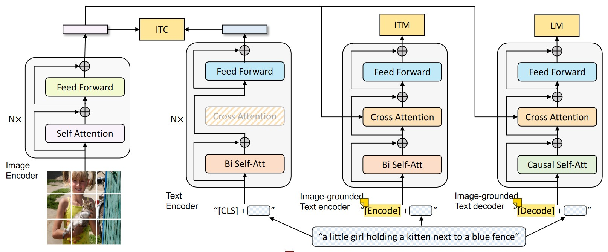
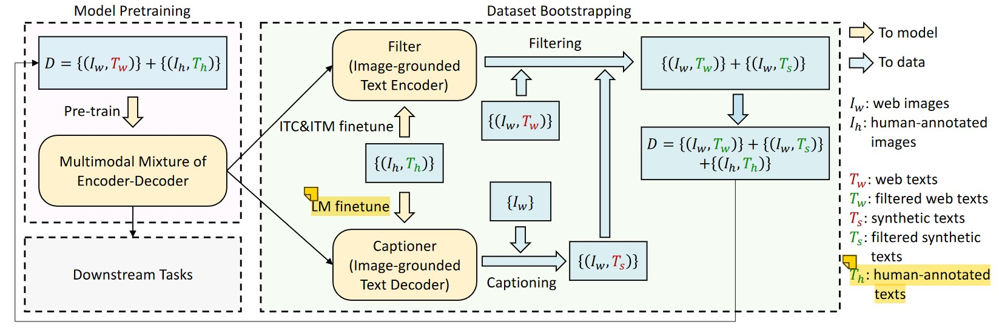

#### Li, J., Li, D., Xiong, C., & Hoi, S. (2022, June). Blip: Bootstrapping language-image pre-training for unified vision-language understanding and generation. In *International Conference on Machine Learning* (pp. 12888-12900). PMLR.

---

#### 1. Motivation

1）原来只有encoder-based model和encoder-decoder model，不能同时兼具Vision-Language Understanding（Retrieval） and Generation（Image caption）

2）提出一种新的dataset boostrapping method

---

#### 2. Methods

##### 2.1 Multimodal mixture of Encoder-Decoder (MED)

##### 2.2 Captioning and Filtering (CapFilt)

1）在nosiy Data上pre-trainBLIP

2）在Human-annotated Data上Fine-tune其Image-grounded Text Encoder和Image-grounded Text Decoder，得到Filter和Captioner

3）Captioner为web images生成更可靠的texts，Filter为web pairs和synthetic pairs滤除nosiy data

4）拿清洗后Data，重新pre-train一个BLIP，性能会提升