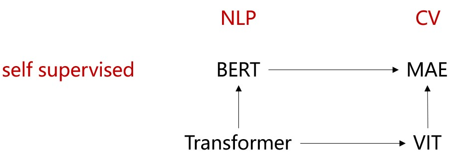
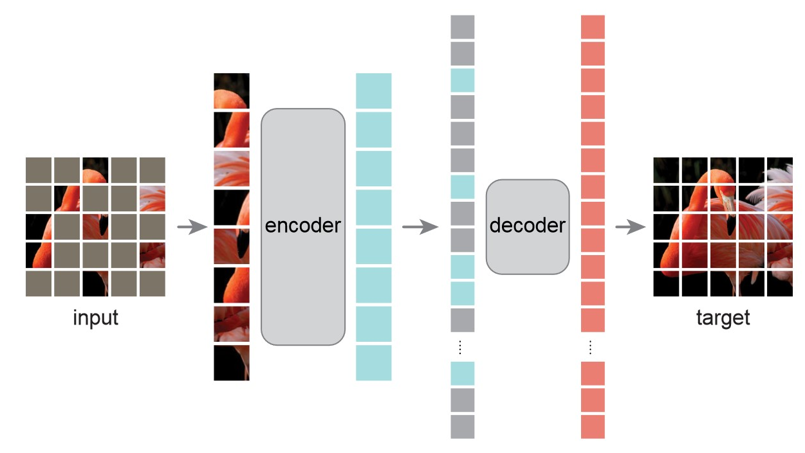

### Masked Autoencoders Are Scalable Vision Learners

#### 1. Motivation: 

类似BERT一样利用“完形填空”，基于VIT将transformer架构扩展到自监督学习

**a)** CNN因为filter的逐步移动，无法清晰地提取出mask patch信息；而VIT输入就是patch，可以清晰地提取出mask patch信息

**b)** 相对于text，image的信息太冗余，直接“完形填空“太简单，插值就能实现，无法形成有意义的self-supervisory task。通过极大地提高mask比例解决

**c)** 相对于word，pixel比较low-level，无法简单地利用MLP作为decoder。需要一个转置的CNN

#### 2. Method:

**Asymmetric encoder-decoder:** encoder和decoder的输入不一样，encoder只输入可见patch，大幅度减少计算量

 - encoder : VIT
 - **lightweight** decoder : another series of Transformer blocks

**training pipeline:**

图片分块 --> 75%比例进行mask --> linear projection + positional embedding --> **可见patch**构成seq --> encoder处理 --> 补上mask patch feature（每个都一样，可学习）构成新seq --> decoder处理 --> mask patch L2 loss

**inference pipeline:**

图片分块 --> 构成seq --> encoder处理 --> 下游处理

