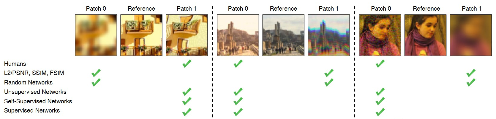
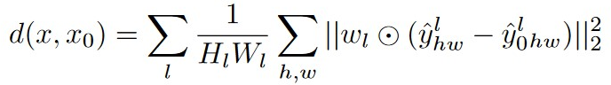
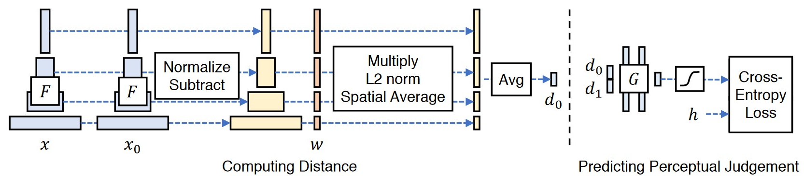
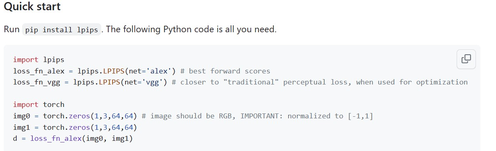

####  Zhang, R., Isola, P., Efros, A. A., Shechtman, E., & Wang, O. (2018). The unreasonable effectiveness of deep features as a perceptual metric. In *Proceedings of the IEEE conference on computer vision and pattern recognition* (pp. 586-595).

------

#### 1. Motivation

a）受perceptual loss的激励，作者发现deep features比传统Metric PSNR、SSIM优秀很多，与人类的感知相似度判断更接近。

b）deep feature可以来自不同network architecture、不同training signal。结论：perceptual similarity是deep visual representation共享的属性

##### 1.1 Previous metric

**a）ℓ2 Euclidean distance：**模糊会导致较大的感知变化，但 L2 变化较小

**b）PSNR：**峰值信噪比

本质还是基于MSE pixel-wise误差，与人的主观感受往往不一致
$$
MSE=\frac{1}{mn}\sum_{i=0}^{m-1}\sum_{j=0}^{n-1}\left \|    I\left ( i,j \right ) - K\left ( i,j \right ) \right \| ^{2}  
$$

$$
PSNR=10\cdot log_{10}\left (  \frac{I_{max}^{2}}{MSE}  \right )
$$

$I$是原始灰度图像，$K$是$I$的噪声近似（有噪声版本）

**c）SSIM：**结构相似性

利用统计特征，分别从亮度、对比度、结构三方面度量图像相似度
$$
l(x,y)=\frac{2\mu _{x}\mu _{y}+c_{1}}{\mu _{x}^{2} +\mu _{y}^{2}+c_{1}  } ,c(x,y)=\frac{2\sigma _{x}\sigma _{y}+c_{2}   }{\sigma_{x}^{2} +\sigma_{y}^{2}+c_{2}   },s(x,y)=\frac{\sigma _{xy}+c_{3}  }{\sigma _{x}\sigma _{y}+c_{3}   }
$$

$$
SSIM(x,y)=\left [  l(x,y)^{\alpha }\cdot c(x,y)^{\beta }\cdot s(x,y)^{\gamma }   \right ]
$$

$$
c_{1}=\left ( k_{1}L   \right ) ^{2} ,c_{2}=\left ( k_{2}L   \right ) ^{2},  c_{3} = \frac{c_{2}}{2} 
$$

$$
L=2^{B}-1,k_{1}=0.01,k_{2}=0.03   
$$

$B$表示灰度范围是多少bit，$\alpha ,\beta ,\gamma$通常都取1

每次计算的时候都从图片上取一个N×N的窗口，然后不断滑动窗口进行计算，最后取平均值作为全局的 SSIM

#### 2. Methods

##### 2.1 LPIPS 

a）两个输入图片$x$,$x_{0}$，从L layer分别得到feature $\hat{y}^{l} $, $\hat{y}_{0}^{l} $

b）对channel维度进行unit normalize

c）pixel-wise取出channel向量，相减，乘以$w_{l}\in \mathbb{R}  ^{C_{l} } $，求L2 norm

d）空间维度取平均，layer维度求和

##### 2.2 LPIPS code

[GitHub - richzhang/PerceptualSimilarity: LPIPS metric. pip install lpips](https://github.com/richzhang/PerceptualSimilarity#b-backpropping-through-the-metric)

